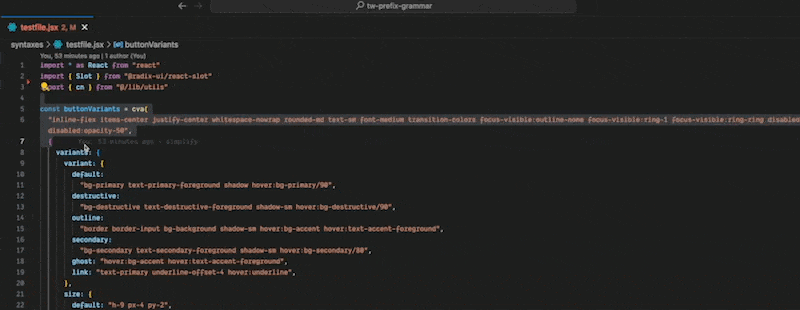

# tw-prefix-grammar README

This adds a `keyword.twprefix` to the grammar so it can be highlighted in any string or string template. It currently only matches `tw*-` and `gd-*`.

It also adds a command to "Prefix tailwind classes".



## Features

## Usage

To use this extension, follow these steps:

1. Select the text that you want to modify (if you want to modify the entire file, you can skip this step).
2. Open the command palette (press `Ctrl+Shift+P` on Windows or `Cmd+Shift+P` on Mac).
3. Type "Prefix tailwind" and select the "Prefix tailwind calsses in selection".
4. Enter the prefix that you want to add to the class names.
5. Input prefix (ie tw-) will be added to all class names in the selected text.
6. Press "Enter" to apply the prefix.

## Customize the syntax highlighting

cmd-shift-p then open `Preferences: Open User Settings(JSON)` and add or update the section and customize with your colors or choice of prefix. Update the setting per workspace.

```
 "tailwindPrefixer.prefix": "tw-",
 "editor.tokenColorCustomizations": {
    "[*Light*]": {
      "textMateRules": [
        {
          "scope": "keyword.twprefix",
          "settings": {
            "foreground": "#648add9e"
          }
        }
      ]
    },
    "[*Dark*]": {
      "textMateRules": [
        {
          "scope": "keyword.twprefix",
          "settings": {
            "foreground": "#648add9e"
          }
        },
      ]
    }
  }
```

## Known Issues

This is a grammar injection rather than a language server because it is very fast to create. If you need your own prefixes, customize `syntaxes/injection.json` and add them there.

## Future enhancements

Add way to read prefix from the tailwind config.

## References

- [syntax highlight guide](https://code.visualstudio.com/api/language-extensions/syntax-highlight-guide)
- [color themes](https://code.visualstudio.com/api/extension-guides/color-theme#syntax-colors)

## For more information

- [Visual Studio Code's Markdown Support](http://code.visualstudio.com/docs/languages/markdown)
- [Markdown Syntax Reference](https://help.github.com/articles/markdown-basics/)

**Enjoy!**

## Credits

Prefixing commands based on code from:

https://github.com/yensubldg/prefix-class-vscode
